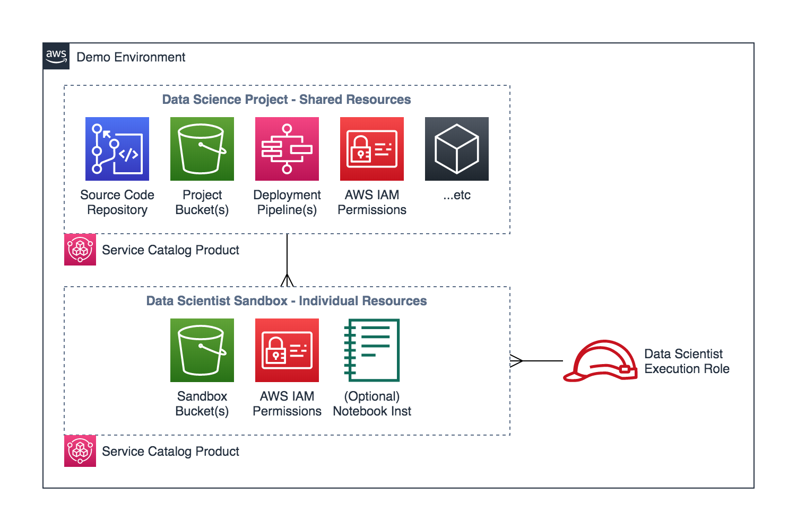

# Frugal MLOps with Amazon SageMaker

Good, automated ML model management and governance is a business problem crossing several different domains: The solution lies in effective **business processes, not just tools** - and will likely span a range of technologies in search of the right tool for each job.

To help navigate the crowd of possibilities, this repo presents an **opinionated example** of how some MLOps goals can be met using Amazon SageMaker and other services on the AWS cloud. Even if the described workflow doesn't work for you, it should introduce some useful tools and control points that could be tailored for your team.


## Guiding Principles

We generally observe the following **significant differences** between MLOps and traditional DevOps:

- Because **data is a dependency**, we'd like tools to track, test, and version data; maintaining a controlled and traceable mapping from data to solution, just like we normally would from dependency library versions to solution.
- Because **data science is experimental**, we'll do what we can to streamline the interactive exploration and experimentation process for data scientists. We'll use the features of SageMaker to deliver traceability even in interactive workflows.
- Because **training models can be resource-intensive**, we'll focus on enforcing control points around existing artifacts - rather than building pipelines that rebuild artifacts on each promotion.

These differences and an aim towards [frugality](https://en.wiktionary.org/wiki/frugality) are reflected in the **high-level decisions** for this repository's architecture:

- **Serverless first**: Prefer serverless orchestration (e.g. [AWS Lambda](https://aws.amazon.com/lambda/) and [Step Functions](https://aws.amazon.com/step-functions/)), to build pipelines where we pay for execution on demand - rather than having to manage cluster capacity as we might with [Kubeflow](https://www.kubeflow.org/) or similar tools.
- **Artifacts over commits**: Git is great for code, and VCS-backed pipelines are great for code-based workflows... But interactive, data-driven experimentation doesn't sit so well producing tidy code repositories with useful DAGs. We'll combine VCS-based flows with artifact-oriented flows to boost productivity and remove friction.

## Solution Architecture

This repository sets out 3 deployable concepts as shown below, each backed by a CloudFormation stack:

- A **project**: The shared infrastructure of a data science project including artifact stores and automation pipelines
- A **sandbox**: *Linking* an *existing* data scientist to a project with access and personal sandbox stores
- A **demo environment**: With an example user role and [AWS Service Catalog](https://aws.amazon.com/servicecatalog/) packaging of the other two deployable "products"



A SageMaker Notebook Execution Role is assumed to be unique to a data scientist, because this is the main level at which notebook permissions can be controlled. Roles are also assumed to be external (pre-existing) so that a data scientist can access multiple projects through one role, since SageMaker Studio users are mapped to one execution role.

In principle, the scientist reads data from the project and performs experiments in their sandbox environment (SageMaker Studio or notebook instance, and sandbox bucket(s)). Successful models and artifacts are then published back up to the project via helper utilities and deployment pipeline(s).


## Getting Started

You can either:

1. Deploy the over-arching **demo environment** (which creates an example SageMaker Execution Role) and then provision the example project and sandbox via the [AWS Service Catalog](https://aws.amazon.com/servicecatalog/) user interface, or
2. [Create a SageMaker Execution Role](https://docs.aws.amazon.com/glue/latest/dg/create-an-iam-role-sagemaker-notebook.html) and then directly deploy the **project** and **sandbox** through CloudFormation

This example is best viewed through [SageMaker Studio](https://docs.aws.amazon.com/sagemaker/latest/dg/gs-studio.html) for additional Experiment tracking and Model Monitor UIs - but you can also instead use the [SageMaker Notebook Instance](https://docs.aws.amazon.com/sagemaker/latest/dg/nbi.html) created for you by the **sandbox** stack.

The 'Launch Stack' buttons in the following steps may not work correctly outside US East (N. Virginia) region. See below sections for more options.

| Step | Set Up via Demo Environment | Set Up Directly with CloudFormation |
|-----:|------------------------------|-------------------------------------|
|    1 | Provision the **demo stack**, and make a note of the `ExampleSageMakerUserRole` output:<br/>[](https://us-east-1.console.aws.amazon.com/cloudformation/home#/stacks/new?stackName=mlopsdemo&templateURL=https://public-frugal-mlops-us-east-1.s3.amazonaws.com/demo.yaml) | [Create](https://docs.aws.amazon.com/glue/latest/dg/create-an-iam-role-sagemaker-notebook.html) (or just make a note of) the name of your target SageMaker Execution Role. Check if your role has a **Path** prefix e.g. `/service-role/`, or just lives directly under `/`. |
|    2 | [Set up](https://docs.aws.amazon.com/sagemaker/latest/dg/gs-studio-onboard.html) SageMaker Studio with your role, if using it.
|    3 | Open the [AWS Service Catalog Console](https://console.aws.amazon.com/servicecatalog/home) and go to *Administration > Portfolios*. Click through to the portfolio you created, and the *Groups, roles and users* tab. **Add** yourself to the portfolio. Now leaving the admin section to go to the [Products list](https://console.aws.amazon.com/servicecatalog/home?#/products) you should see two available products.<br/><br/>Select the **Data Science Project** and **launch product**. Fill out the parameters as per CloudFormation steps -> | Click here to provision the **project stack**: <br/>[](https://us-east-1.console.aws.amazon.com/cloudformation/home#/stacks/new?stackName=mlopsproject&templateURL=https://public-frugal-mlops-us-east-1.s3.amazonaws.com/project.yaml)<br/><br/>Choose a name that works for you; leave the Project ID as default `forestcover`. Enter a **valid email address.** |
|      | Wait for the **project** to deploy
|    4 | Launch a **Data Scientist Sandbox** product with parameters as per CloudFormation steps -> | Click here to provision the **sandbox stack**: <br/>[](https://us-east-1.console.aws.amazon.com/cloudformation/home#/stacks/new?stackName=mlopssandbox&templateURL=https://public-frugal-mlops-us-east-1.s3.amazonaws.com/sandbox.yaml)<br/><br/>Use the **SageMaker Execution Role Name and Path from above** for the `UserExecutionRole` and `UserExecutionRolePath` parameters, and the same **ProjectId** as created in the project stack. |
|      | Wait for the **sandbox** to deploy | |

Once the project and sandbox are deployed, you're ready to follow through the notebooks in the [notebooks/](notebooks) folder.

- If using a SageMaker Notebook Instance, just find the instance created for you by the **sandbox** stack in the [Amazon SageMaker Console](https://console.aws.amazon.com/sagemaker/home?#/notebook-instances) and **Open JupyterLab**: This repository will already be cloned for you.
- If using SageMaker Studio, open a **System Terminal** and `git clone` this repository's URL.

> ⚠️ **KNOWN ISSUE:** Per [Issue #2](https://github.com/apac-ml-tfc/frugal-mlops/issues/2), you may get an `AccessDenied` error at the end of notebook 1 when attempting to assume the ProjectSudoRole. See the linked issue for a manual workaround.


## Customization and Other Deployment Options

To build this stack from source you'll need to install the [AWS SAM CLI](https://docs.aws.amazon.com/serverless-application-model/latest/developerguide/serverless-sam-cli-install.html) and either a UNIX-like shell environment (MacOS, Linux) or to translate the referenced `*.sh` scripts to commands which will run on your machine.

AWS SAM stages built Lambda function bundles to an S3 bucket for CloudFormation deployment, so you'll also need to create a "staging" bucket in your target account and region.

Because AWS Service Catalog introduces a separate versioning construct, the easiest way to interactively develop the **project** and **sandbox** stacks is to deploy and update them directly via CloudFormation - without **demo**.

This process is automated by the [deployment/deploy-dev.sh](deployment/deploy-dev.sh) script, which will create or update a companion pair of project and sandbox stack used as follows:

```sh
# Run from the deployment folder:
cd deployment
# Build and deploy a `project`+`sandbox` stack pair:
./deploy-dev.sh my-staging-bucket-name forestcover AmazonSageMaker-ExecutionRole-XYZ myemail@example.com
```

TODO: S3 bucket owner condition https://docs.aws.amazon.com/AmazonS3/latest/dev/bucket-owner-condition.html
